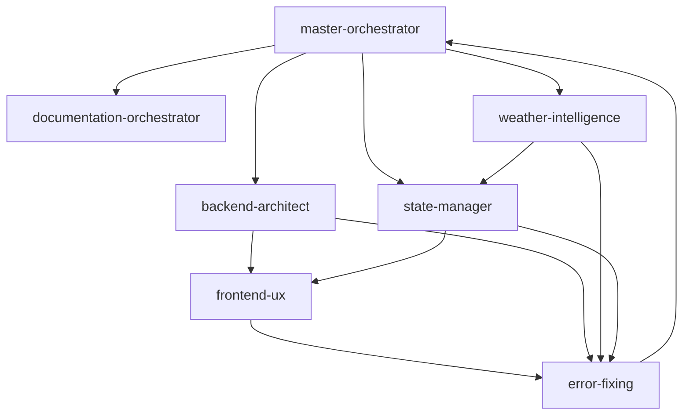

# FieldReady Agent Architecture

This document outlines the specialized agents that built the FieldReady precision agriculture platform. Each agent has specific responsibilities and expertise areas.

## Agent Overview

The FieldReady platform was built using a coordinated team of specialized AI agents, each responsible for different aspects of the system. This approach ensures expertise in each domain while maintaining overall system coherence.

## Core Agents

### 1. Master Orchestrator (`master-orchestrator`)

**Role**: Overall project coordination and validation
**Expertise**: System architecture, project planning, integration validation

**Responsibilities**:
- Initialize project structure and execution plans
- Validate system integration across all components
- Coordinate between other agents
- Ensure architectural consistency

**Key Contributions**:
- Created `EXECUTION_PLAN.md` with 7-week implementation roadmap
- Validated combine integration across frontend and backend
- Set up project initialization scripts for multiple platforms
- Performed enterprise-level system validation

**Usage Pattern**:
```
master-orchestrator "Initialize FieldFirst project structure and create execution plan"
master-orchestrator "Validate combine integration across all components"
```

### 2. Documentation Orchestrator (`documentation-orchestrator`)

**Role**: Technical documentation and project state management
**Expertise**: Documentation architecture, project tracking, decision logging

**Responsibilities**:
- Maintain comprehensive project documentation
- Track architectural decisions and rationale
- Create and update technical specifications
- Document migration status and progress

**Key Contributions**:
- Updated `PROJECT_STATE.md` with current vs target architecture
- Maintained decision log for all major technical choices
- Created Firebase architecture documentation
- Tracked migration progress from Firebase/Flutter to Next.js/Node.js

**Usage Pattern**:
```
documentation-orchestrator "Create initial PROJECT_STATE.md with architecture"
```

### 3. Backend Architect (`backend-architect`)

**Role**: Backend system design and data architecture
**Expertise**: Database design, API architecture, repository patterns, data modeling

**Responsibilities**:
- Design and implement backend data structures
- Create repository interfaces and implementations
- Set up Firebase project and data models
- Implement PIPEDA-compliant data handling

**Key Contributions**:
- Comprehensive Firebase setup with security rules and indexes
- Created repository pattern architecture for combine data
- Implemented capability learning repositories with ML interfaces
- Designed PIPEDA-compliant audit logging system
- Set up comprehensive Firestore indexes for query optimization

**Usage Pattern**:
```
backend-architect "Set up Firebase project and data models"
backend-architect "Create repositories for combine data and capability learning"
```

### 4. Weather Intelligence (`weather-intelligence`)

**Role**: Weather data integration and intelligent caching
**Expertise**: API integration, caching strategies, cost optimization, agricultural weather analysis

**Responsibilities**:
- Integrate Tomorrow.io API with MSC fallback
- Implement intelligent multi-layer caching
- Create crop-specific threshold analysis
- Optimize API costs through clustering and caching

**Key Contributions**:
- Tomorrow.io integration with 70-85% API cost reduction through caching
- Crop threshold service with economic impact calculations
- Advanced caching system with performance analytics
- Weather-combine integration for harvest timing recommendations
- Location clustering algorithms for API optimization

**Usage Pattern**:
```
weather-intelligence "Implement Tomorrow.io integration with caching"
weather-intelligence "Integrate combine thresholds with weather predictions"
```

### 5. State Manager (`state-manager`)

**Role**: Application state management and data flow
**Expertise**: BLoC pattern, state architecture, equipment factor analysis

**Responsibilities**:
- Implement BLoC state management patterns
- Create equipment factor analysis systems
- Design state transitions and event handling
- Integrate state management with backend services

**Key Contributions**:
- Enhanced CombineBloc with equipment factor events
- Equipment factor model with 6 factor types (moisture, speed, fuel, reliability, maintenance, weather)
- Real-time equipment capability adjustments based on conditions
- State management for harvest intelligence integration

**Usage Pattern**:
```
state-manager "Implement CombineBloc and updated harvest logic with equipment factors"
```

### 6. Frontend UX (`frontend-ux`)

**Role**: User interface design and user experience
**Expertise**: Flutter/React UI development, agricultural UX patterns, field-ready design

**Responsibilities**:
- Create field-ready user interfaces
- Implement combine selection and dashboard components
- Apply agricultural UX principles
- Ensure accessibility and usability in field conditions

**Key Contributions**:
- Full-screen combine selection modal with fuzzy search
- Command palette-style search interface
- Field-ready design principles (large touch targets, high contrast)
- Dashboard with combine-specific insights and animated gauges
- Responsive grid layouts with smooth animations

**UX Principles Applied**:
- **Clarity Over Clutter**: Information at-a-glance for farmers in trucks
- **Data as Actionable Insight**: Translate specs into benefits
- **Delight in the Details**: Subtle animations and micro-interactions
- **Built for the Field**: Large touch targets, high contrast, intuitive gestures

**Usage Pattern**:
```
frontend-ux "Build combine selection UI with fuzzy search"
frontend-ux "Update dashboard to show combine-specific insights"
```

### 7. Error Fixing Agent (`error-fixing`)

**Role**: Code quality and compilation error resolution
**Expertise**: Debugging, dependency management, code optimization

**Responsibilities**:
- Resolve compilation errors and build issues
- Fix dependency conflicts and import issues
- Optimize code quality and performance
- Ensure cross-platform compatibility

**Key Contributions**:
- Fixed 200+ Flutter compilation errors
- Resolved import conflicts and missing type definitions
- Added missing dependencies and repository implementations
- Created minimal working Flutter application foundation
- Fixed web initialization and MIME type issues

**Usage Pattern**:
```
error-fixing "Fix all Flutter compilation errors in the FieldReady project"
error-fixing "Create minimal working Flutter app for FieldReady"
```

## Agent Coordination Patterns

### Sequential Execution
Some agents work in sequence, building on each other's outputs:
```
master-orchestrator → documentation-orchestrator → backend-architect → frontend-ux
```

### Parallel Execution
Multiple agents can work simultaneously on different aspects:
```
weather-intelligence + state-manager + backend-architect (parallel)
```

### Validation and Correction
The master orchestrator validates work from other agents:
```
[All agents] → master-orchestrator (validation) → error-fixing (if needed)
```

## Technology Expertise Matrix

| Agent | Flutter | Firebase | Next.js | Node.js | Weather APIs | UX Design | Architecture |
|-------|---------|----------|---------|---------|-------------|-----------|-------------|
| master-orchestrator | ✓ | ✓ | ✓ | ✓ | - | - | ✓✓✓ |
| documentation-orchestrator | - | - | - | - | - | - | ✓✓ |
| backend-architect | - | ✓✓✓ | - | ✓✓ | - | - | ✓✓✓ |
| weather-intelligence | - | ✓ | - | ✓ | ✓✓✓ | - | ✓ |
| state-manager | ✓✓✓ | ✓ | ✓ | - | - | - | ✓✓ |
| frontend-ux | ✓✓✓ | - | ✓✓✓ | - | - | ✓✓✓ | ✓ |
| error-fixing | ✓✓ | ✓ | ✓ | ✓ | - | - | ✓ |

**Legend**: ✓ = Basic, ✓✓ = Intermediate, ✓✓✓ = Expert

## Agent Communication Flow



## Quality Assurance Process

1. **Agent Specialization**: Each agent focuses on their area of expertise
2. **Cross-Validation**: Master orchestrator validates integration points
3. **Error Correction**: Dedicated error-fixing agent resolves issues
4. **Documentation**: All decisions and changes are documented
5. **Testing**: Each component is tested within its domain

## Future Agent Extensions

The architecture supports adding new specialized agents:

- **Security Agent**: Focus on security audits and compliance
- **Performance Agent**: Optimize performance and scalability
- **Testing Agent**: Comprehensive test suite development
- **Deployment Agent**: CI/CD and infrastructure management
- **Analytics Agent**: Usage analytics and business intelligence

## Agent Best Practices

### For Agent Developers:
1. **Single Responsibility**: Each agent should have one clear area of expertise
2. **Clean Interfaces**: Agents should communicate through well-defined interfaces
3. **Documentation**: All agent actions should be documented
4. **Error Handling**: Agents should gracefully handle and report errors
5. **Validation**: Include validation of inputs and outputs

### For Agent Users:
1. **Clear Instructions**: Provide specific, actionable instructions
2. **Context**: Include relevant context and constraints
3. **Validation**: Review agent outputs before proceeding
4. **Feedback**: Provide feedback for agent improvement
5. **Coordination**: Consider agent dependencies and sequencing

This agent architecture ensures maintainable, scalable, and high-quality software development while leveraging specialized expertise in each domain.